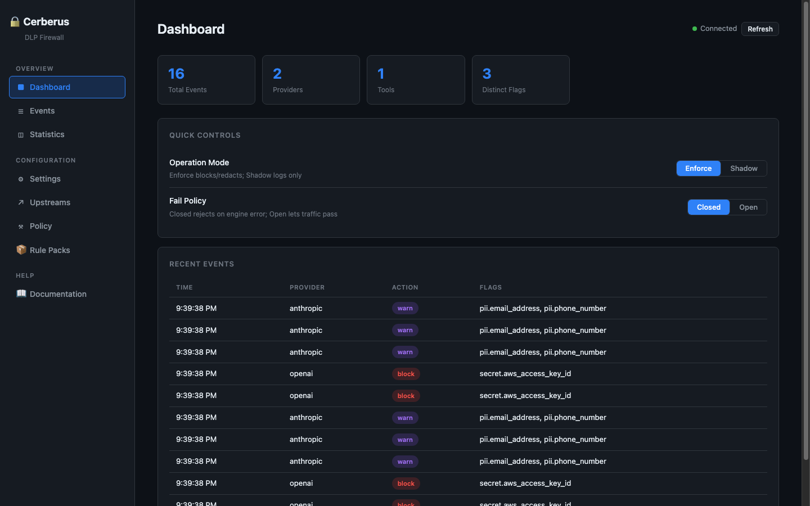
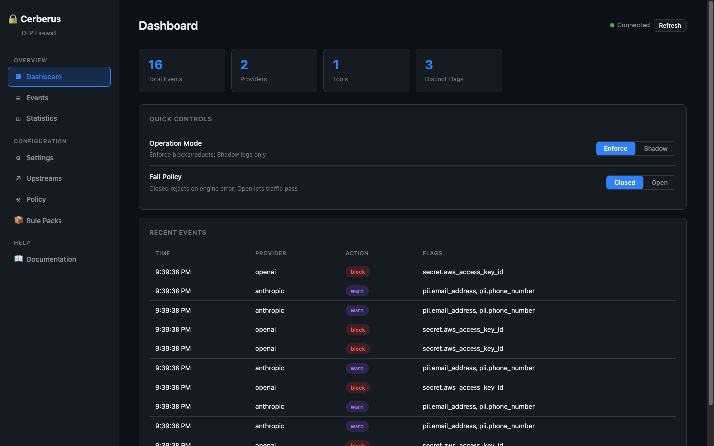
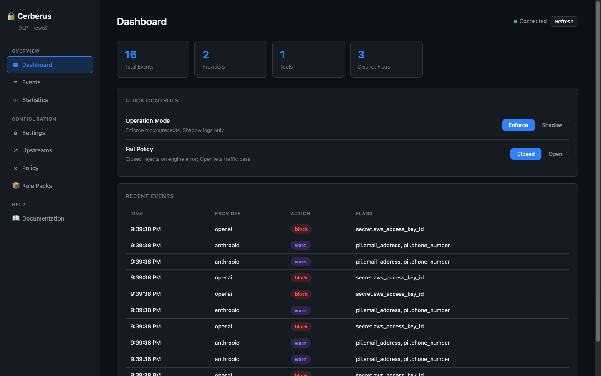
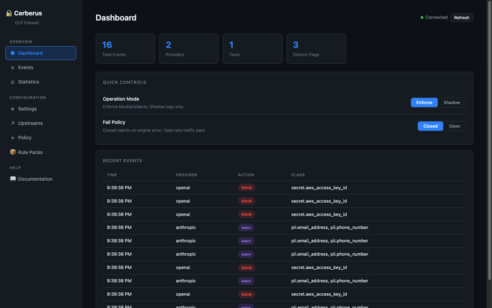
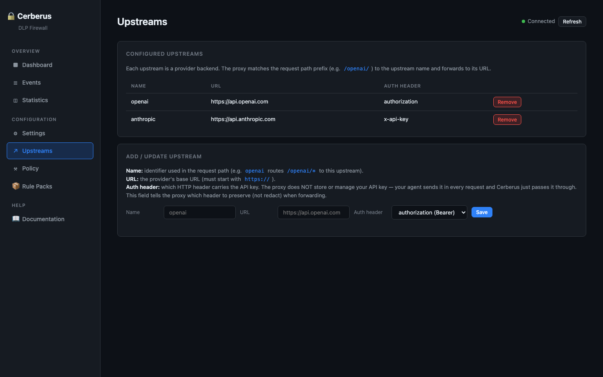
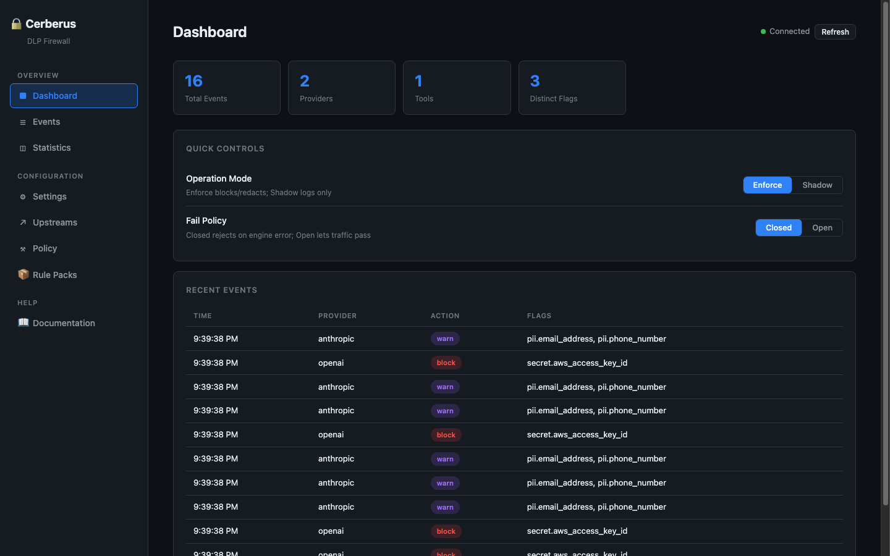
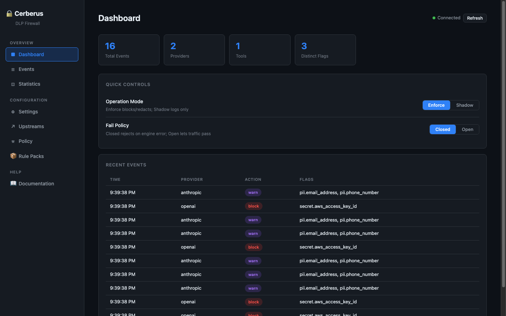
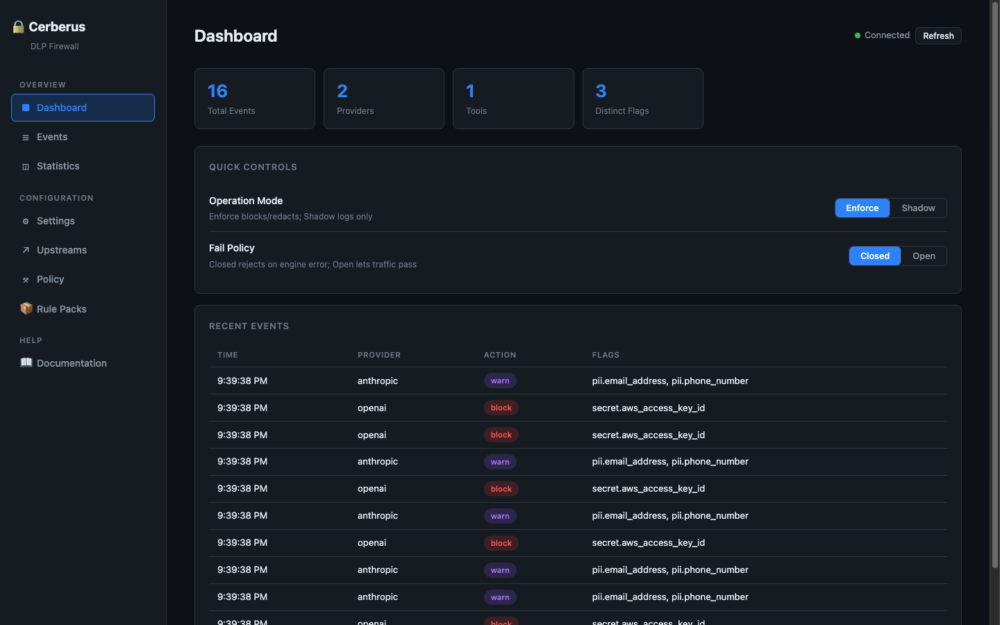

# Cerberus

DLP firewall for LLM agents — blocks secrets and PII from leaving your machine.

Cerberus is a local reverse proxy that sits between your AI coding agent (Claude Code, Codex, opencode) and the LLM provider. It scans every request in real time, detects secrets and PII, and blocks or redacts them before they reach the API.

## Dashboard

Cerberus includes a built-in web dashboard for managing the proxy without CLI commands. Access it at `http://127.0.0.1:8787/api/dashboard` when the daemon is running.

### Overview



### Events



### Statistics



### Settings



### Upstreams



### Policy



### Rule Packs



### Documentation



The dashboard lets you:
- **Toggle operation mode** (enforce / shadow) and fail policy (closed / open) with one click
- **View audit events** with timestamps, flags, and actions (never raw secret values)
- **See statistics** by provider, tool, and top flags
- **Edit configuration** (listen address, mode, fail policy, max body size)
- **Manage upstreams** (add, update, remove provider backends)
- **Configure policy** (category actions, rule overrides, allowlist for false positive triage)
- **Install signed rule packs** (Pro tier, Ed25519-signed)
- **Browse documentation** (quick start, CLI commands, API endpoints, security guarantees)

All data flows through the same CSP-protected dashboard — no inline scripts, no external dependencies, no raw secret values ever displayed.

```
┌──────────┐      ┌──────────┐      ┌──────────┐
│  Agent   │─────►│ Cerberus │─────►│ Provider │
│ (LLM)    │      │  Proxy   │      │ (API)    │
└──────────┘      └────┬─────┘      └──────────┘
                       │
                       ▼
               ┌──────────────┐
               │  Audit Store │
               │  (SQLite)    │
               │  hashes only │
               └──────────────┘
```

## Why

AI coding agents send your code, prompts, and context to external LLM APIs. If a secret (API key, token, `.env` file) or PII (email, phone) is in that payload, it leaves your machine. Cerberus intercepts the request, scans it with a regex-based detection engine, and takes action before forwarding:

- **Block** the request entirely (return 403)
- **Redact** the sensitive value (replace with a placeholder)
- **Warn** (log the finding, let it pass — shadow mode)

Raw secret values are **never** stored — only SHA-256 hashes, flags, and counts. Nothing is sent to any third party.

## How it works

```
1. Agent sends request → Cerberus intercepts
2. Body is decoded (JSON / text / multipart-line)
3. Detection engine scans with the loaded rule pack (13 rules by default)
4. Findings produced: matched patterns + SHA-256 hashed values
5. Action applied: block (403), redact (replace token), or pass through
6. Only hashes/counts stored in SQLite; raw values discarded
7. Redacted request forwarded to provider
8. (Optional) Desktop notification with flag + hash (never the raw secret)
```

### Detection rules (default pack)

| Flag | Category | Action | What it catches |
|------|----------|--------|-----------------|
| `secret.openai_api_key` | secrets | block | `sk-...` keys |
| `secret.anthropic_api_key` | secrets | block | `sk-ant-...` keys |
| `secret.aws_access_key_id` | secrets | block | `AKIA...` keys |
| `secret.generic_bearer_token` | secrets | redact | `Bearer ...` tokens |
| `secret.github_token` | secrets | block | `ghp_...` / `gho_...` tokens |
| `secret.stripe_key` | secrets | block | `sk_live_...` / `sk_test_...` |
| `secret.google_api_key` | secrets | block | `AIza...` keys |
| `secret.slack_token` | secrets | block | `xox[abp]-...` tokens |
| `pii.email_address` | pii | warn | email addresses |
| `pii.phone_number` | pii | warn | phone numbers |
| `secret.pem_private_key` | secrets | block | PEM private key blocks |
| `secret.id_rsa_ssh_key` | secrets | block | SSH `id_rsa` blocks |
| `secret.env_block` | secrets | block | `.env` `KEY=value` dumps |

The engine uses Rust's `regex` crate (RE2-like, linear-time) — no ReDoS.

### Modes

| Mode | Behavior |
|------|----------|
| **enforce** (default) | Apply actions: block / redact / warn |
| **shadow** | Scan and log only, never block (for testing) |

### Fail policy

| Policy | Behavior |
|--------|----------|
| **closed** (default) | Reject request if the engine fails |
| **open** | Let request pass if the engine fails |

### Security guarantees

- **Zero leak**: raw secrets never written to disk, logs, telemetry, or notifications — only SHA-256 hashes
- **Fail-closed**: if the engine crashes, requests are rejected (not leaked)
- **No ReDoS**: linear-time regex engine, all patterns fuzzed
- **Break-glass audit**: `cerberus allow-once` bypasses blocks with a recorded reason
- **MITM opt-in**: TLS interception is off by default, requires explicit CA generation + host allowlist

## Installation

### macOS (Homebrew)

```bash
brew install cerberus
```

### Linux / macOS (install script)

```bash
curl -fsSL https://raw.githubusercontent.com/alexeirojas87/cerberus/main/install.sh | sh
```

### Windows (winget)

```powershell
winget install cerberus
```

Alternatively, download the `.zip` from the [releases page](https://github.com/alexeirojas87/cerberus/releases), verify the SHA256 against `SHA256SUMS`, and extract `cerberus.exe` to a directory on your `PATH`.

### Docker

```bash
docker run -d \
  --name cerberus \
  -p 8787:8787 \
  -e CERBERUS_ADMIN_TOKEN="your-strong-admin-token->=24-chars" \
  cerberus/cerberus
```

### Docker Compose

```bash
# Set the admin token (required for non-loopback binds)
export CERBERUS_ADMIN_TOKEN="your-strong-admin-token->=24-chars"
docker-compose up -d
```

### Helm (Kubernetes)

```bash
helm install cerberus deploy/helm/cerberus \
  --set config.listen="0.0.0.0:8080" \
  --set adminToken.create=true \
  --set adminToken.value="your-strong-admin-token->=24-chars"
```

The chart ships a ConfigMap, a Secret for the admin token, and a readiness probe on `/health`. Values are validated at `helm install` (fail-fast, not at runtime).

### Build from source

```bash
git clone https://github.com/alexeirojas87/cerberus.git
cd cerberus
cargo build --release -p cerberus
# Binary at target/release/cerberus
```

## Quick start

### 1. Initialize

```bash
cerberus init
```

Auto-detects installed agents (Claude Code, Codex, opencode) and creates `~/.cerberus/config.yaml` with default settings: OpenAI + Anthropic upstreams, enforce mode, fail-closed.

### 2. Start the daemon

```bash
cerberus start
```

The proxy listens on `127.0.0.1:8787`.

### 3. Point your agent at Cerberus

```bash
# Claude Code
export CLAUDE_CODE_BASE_URL=http://127.0.0.1:8787

# opencode
export OPENCODE_BASE_URL=http://127.0.0.1:8787

# Codex
export CODEX_BASE_URL=http://127.0.0.1:8787
```

### 4. Verify it works

```bash
cerberus test "my api key is sk-abcDEFghijklmnopqrstuvwxyz1234"
# → Detects the secret and reports it (flag + SHA-256 hash, never the raw value)
```

### 5. (Optional) MITM interception

For agents that don't honor `*_BASE_URL` overrides:

```bash
cerberus mitm init                          # generate a local CA
cerberus mitm enable api.openai.com        # allowlist exact host
cerberus mitm status
```

MITM is **opt-in and fail-closed**: it refuses to bind if the CA material is missing, mismatched, or tampered. Only allowlisted hosts are intercepted (exact match, no wildcards).

## Commands

| Command | Description |
|---------|-------------|
| `cerberus init` | Auto-detect agents and create config |
| `cerberus start` | Start the local proxy daemon |
| `cerberus stop` | Stop the local proxy daemon |
| `cerberus status` | Show daemon status |
| `cerberus scan <file>` | Scan a file for secrets |
| `cerberus test <text>` | Test detection with inline text |
| `cerberus doctor` | System diagnostics (daemon PID, rule count, agents) |
| `cerberus mode <shadow\|enforce>` | Change operation mode |
| `cerberus mitm <init\|enable\|disable\|status>` | Manage MITM/forward proxy (opt-in) |
| `cerberus pack <install\|rollback\|list>` | Manage signed rule packs (Pro) |
| `cerberus license` | Show active license tier (Free/Pro) |

## Configuration

Edit `~/.cerberus/config.yaml` (or `%APPDATA%\Cerberus\config.yaml` on Windows). Override the path with `CERBERUS_CONFIG`.

```yaml
listen: 127.0.0.1:8787
mode: enforce              # enforce | shadow
fail_policy: closed        # closed | open
admin_token: "your-strong-admin-token->=24-chars"
upstreams:
  openai:
    url: https://api.openai.com
    path_prefix: /openai/
    auth_header: authorization
  anthropic:
    url: https://api.anthropic.com
health_path: /health
telemetry:
  enabled: false           # opt-in, off by default
```

### Environment variables

| Variable | Description |
|----------|-------------|
| `CERBERUS_LISTEN` | Override `listen` (e.g. `0.0.0.0:8080`) |
| `CERBERUS_ADMIN_TOKEN` | Admin token for the control plane API |
| `CERBERUS_CONFIG` | Path to config file |
| `CERBERUS_LICENSE_PATH` | Path to a signed license file (Pro) |
| `CERBERUS_LICENSE_PUBLIC_KEY` | Public key for license verification |
| `CERBERUS_PACK_TRUST_ROOT` | Ed25519 public key for signed pack verification |
| `CERBERUS_UPSTREAMS` | JSON upstreams config (Docker/Compose) |
| `CERBERUS_RETENTION_DAYS` | Audit retention in days (default: 90) |

### API endpoints

| Endpoint | Method | Description |
|----------|--------|-------------|
| `/health` | GET | Health check (status, version, mode, upstream count) |
| `/api/config` | GET | Current configuration (admin token never returned) |
| `/api/config` | PUT/PATCH | Update configuration (hot-swap, no restart) |
| `/api/upstreams` | GET/POST/PUT/DELETE | CRUD upstreams (admin-auth) |
| `/api/events` | GET | Audit events (flags + hashes, never raw) |
| `/api/stats` | GET | Aggregated stats by provider with top flags |
| `/api/allowlist` | POST/DELETE | Add/remove allowlist entries (FP triage) |
| `/api/dashboard` | GET | HTML dashboard (CSP-protected, no inline scripts) |
| `/api/packs` | GET/POST/DELETE | Install/rollback signed rule packs (Pro) |

## Architecture

```
Client/Agent ──► Cerberus Proxy ──► LLM Provider
                    │
                    ├── Detection Engine (regex RE2-like, linear time)
                    ├── Redaction Engine (block/redact/warn/allow)
                    ├── Audit Store (SQLite, hashes only)
                    ├── Config API + Dashboard (localhost)
                    ├── Dev Feedback (desktop notification, rate-limited)
                    ├── MITM Forward Proxy (opt-in, allowlisted hosts)
                    └── Telemetry (opt-in, anonymous only)
```

### Crates

| Crate | Role |
|-------|------|
| `cerberus` | CLI + local daemon (the binary you run) |
| `cerberus-engine` | Detection engine: rules, scanning, redaction, vault |
| `cerberus-proxy` | Reverse proxy: decode, scan, policy, forward, API, dashboard |
| `cerberus-store` | Audit store (SQLite), durability, backpressure |
| `cerberus-packs` | Signed rule packs, licensing, telemetry |
| `benchkit` | Load testing helpers |

### Data flow

1. **Agent** sends an HTTP request to `http://127.0.0.1:8787`
2. **Cerberus proxy** decodes the body (JSON / text), extracts the prompt
3. **Detection engine** scans with the loaded rule pack — each rule has a regex pattern, category, severity, and action
4. **Findings** are produced with the matched flag + SHA-256 hash of the value (never the raw value)
5. **Policy** decides what to do per finding: block (403), redact (replace the token in the body), warn (log only)
6. **Audit store** persists the event: flag, hash, action, timestamp — raw values discarded
7. **Forward** the (possibly redacted) request to the upstream provider
8. **Dev feedback** (optional): desktop notification with flag + hash, rate-limited to 1/sec

### Rule packs (Pro)

- **Free tier**: 13 built-in rules (the default pack above), local daemon, full detection engine
- **Pro tier**: signed rule packs with auto-update/rollback, advanced config
- Packs are Ed25519-signed and verified against a trust root at boot
- A tampered pack is deactivated and persisted (fail-closed), never silently loaded
- Without a trust root, the engine boots with 0 packs (fail-closed)

## Telemetry

Telemetry is **disabled by default**. If enabled, it sends only anonymous metrics:
- Cerberus version and OS
- Rule count and aggregate event counts
- Uptime and installation age
- A random persistent installation ID (UUID)

It **never** sends: raw secrets, PII, scan findings, flags, hashes, user names, emails, system paths, or prompt data.

## Platform notes

| Platform | Config dir | Process management |
|----------|-----------|-------------------|
| macOS / Linux | `~/.cerberus/` | PID file + `kill` (SIGTERM graceful) |
| Windows | `%APPDATA%\Cerberus\` | `tasklist` / `taskkill` (cooperative → force) |

## License

This project is licensed under the terms described in the repository's license file.
